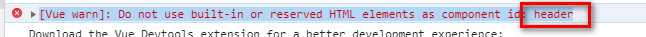
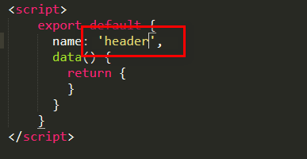

# 仿饿了么App Vue开发记录

## 组件
1. loading组件		

	
## bug记录
1.vue名称与html冲突
```
vue.esm.js?efeb:628 [Vue warn]: Do not use built-in or reserved HTML elements as component id: header
```
	
	
将name修改为其他名字，如：
```
<script>
	export default {
	  name: 'headTop',
	  data() {
	  	return {
	  	}
	  }
	}
</script>
```
2.